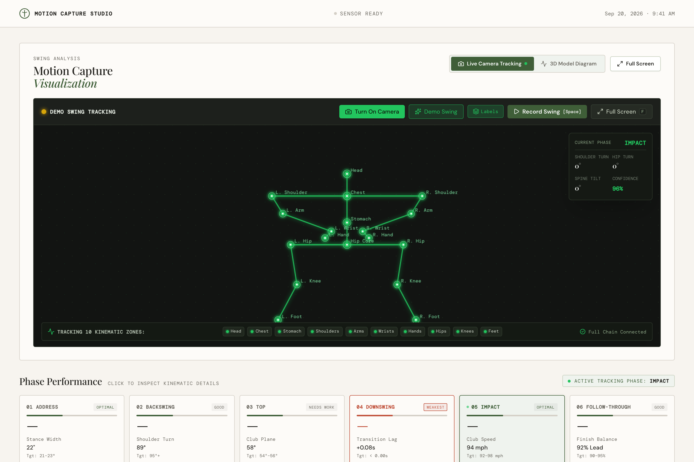
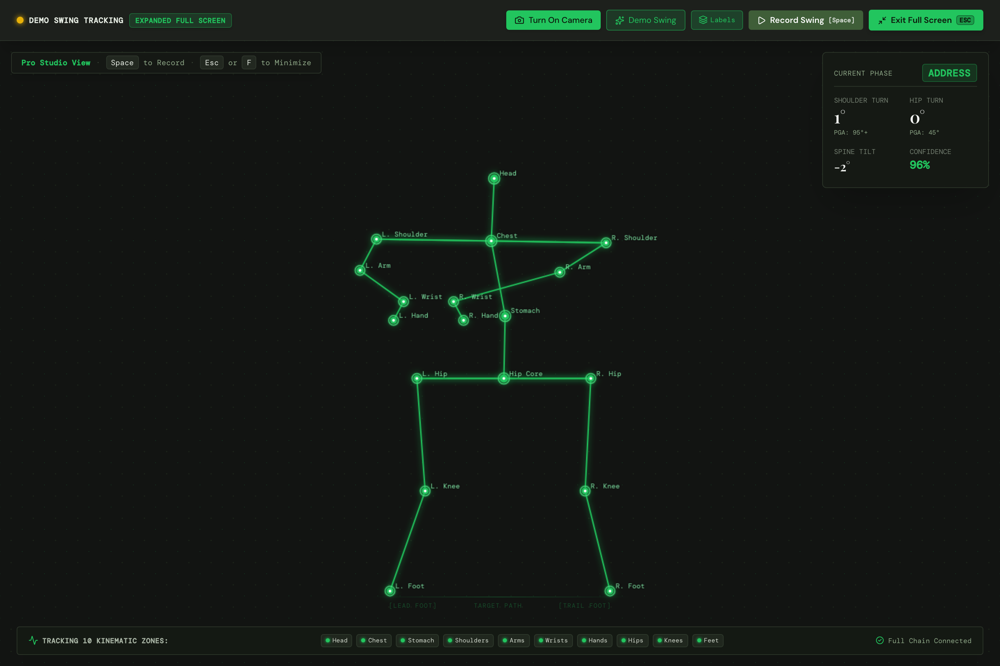
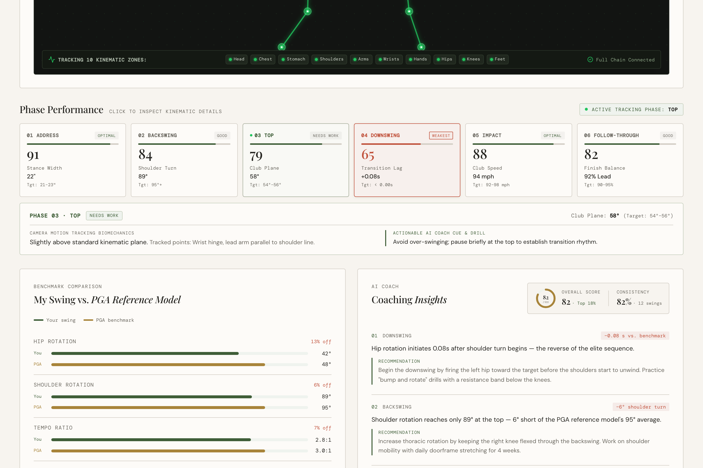
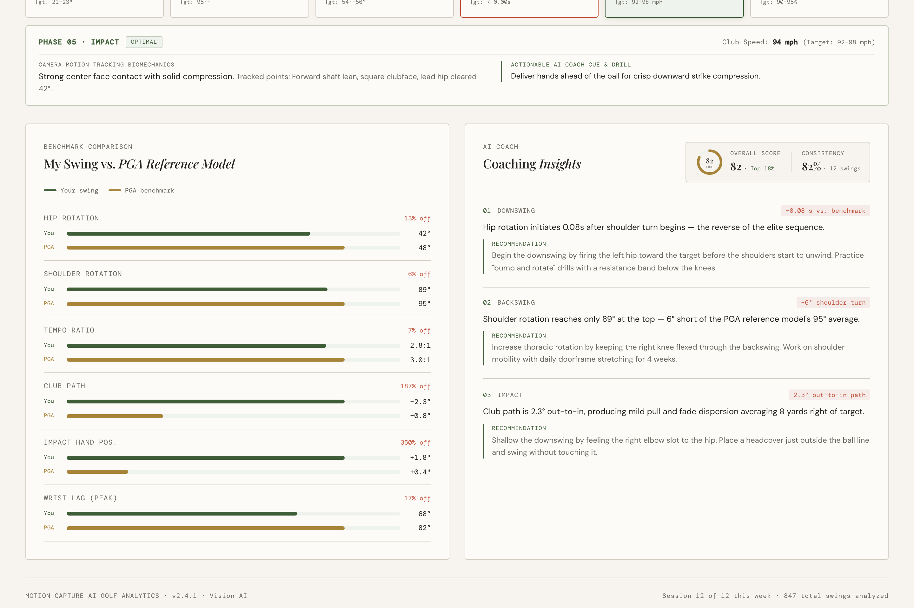
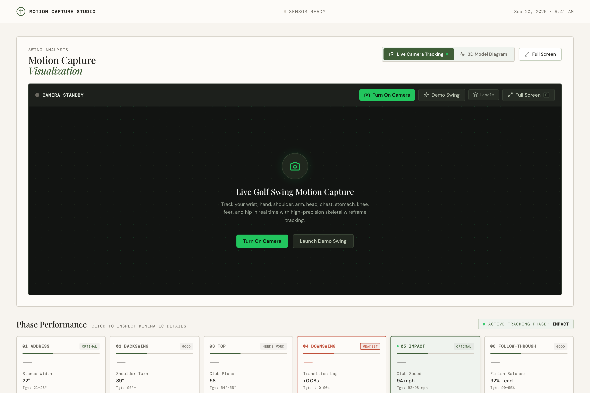

# 🏌️‍♂️ Kinematic Vision AI — Premium AI Golf Motion Dashboard

> An elite computer-vision powered golf swing motion capture and biomechanical analytics dashboard. Delivers real-time 60 FPS skeletal tracking across 10 kinematic zones, live telemetry HUD, dual full-screen studio mode, 6-phase swing segmentation, PGA Tour benchmark comparisons, and actionable AI coaching cues—running 100% client-side with zero cloud video transmission.

---

[](https://react.dev/)
[](https://www.typescriptlang.org/)
[](https://developers.google.com/mediapipe)
[](https://tailwindcss.com/)
[](https://vitejs.dev/)
[](https://opensource.org/licenses/MIT)

---

## 📋 Table of Contents

- [Visual Tour & Key Features](#-visual-tour--key-features)
  - [1. Real-Time Vision AI Motion Capture Studio](#1-real-time-vision-ai-motion-capture-studio)
  - [2. Full Screen Pro Studio Mode](#2-full-screen-pro-studio-mode)
  - [3. 6-Phase Swing Biomechanics & Performance Timeline](#3-6-phase-swing-biomechanics--performance-timeline)
  - [4. PGA Tour Elite Benchmark Comparison](#4-pga-tour-elite-benchmark-comparison)
  - [5. AI Coach Insights & Scoring Matrix](#5-ai-coach-insights--scoring-matrix)
- [10 Tracked Kinematic Zones](#-10-tracked-kinematic-zones)
- [Keyboard Ergonomics](#-keyboard-ergonomics)
- [Tech Stack & Architecture](#-tech-stack--architecture)
- [Quick Start Guide](#-quick-start-guide)
- [Project Structure](#-project-structure)
- [Privacy & On-Device Processing](#-privacy--on-device-processing)
- [Product Requirements Document](#-product-requirements-document)
- [License](#-license)

---

## 📸 Visual Tour & Key Features

### 1. Real-Time Vision AI Motion Capture Studio



* **Dual-Inference Engine:** Automatically initializes Google MediaPipe's `PoseLandmarker` for real-time webcam skeletal estimation. If a webcam is unavailable or permissions are denied, it seamlessly switches to an onboard high-fidelity biomechanical kinematics engine (`generateDemoGolfSwingPoints`).
* **High-Contrast Skeletal Wireframe:** Renders an emerald-glow (`#22C55E`) skeletal wireframe on an HTML5 canvas overlay at native display resolution with customizable joint label overlays.
* **Live Telemetry HUD:** Displays real-time **Shoulder Turn Angle**, **Pelvic Hip Rotation**, **Spine Tilt Angle**, and **Inference Confidence %**.
* **Real-Time Phase Indicator:** Automatically detects Address, Backswing, Top, Downswing, Impact, and Follow-through.

---

### 2. Full Screen Pro Studio Mode



* **Distance-Optimized Ergonomics:** Designed specifically for golfers standing 6–10 feet back from their display with a golf club in hand.
* **Dual Fullscreen Engine:** Attempts native HTML5 Fullscreen API (`requestFullscreen()`) with an instant viewport expansion fallback (`fixed inset-0 z-[9999] w-screen h-screen`), ensuring support across all browsers, monitors, and embedded iframes.
* **Large-Format Telemetry Counters:** Enlarges angle readouts to bold 24px+ serif typography with target PGA standards (`PGA: 95°+`, `PGA: 45°`).
* **Floor Stance Alignment Guide:** Displays a subtle target line and foot alignment guide (`[Lead Foot]`, `Target Path`, `[Trail Foot]`) for repeatable address framing.
* **Rapid Exit Controls:** Instant one-click exit pill and keyboard support via <kbd>Esc</kbd> or <kbd>F</kbd>.

---

### 3. 6-Phase Swing Biomechanics & Performance Timeline



* **6 Sequential Swing Phases:**
  * **01 Address** (22" Stance Width · Target 21–23" · Optimal)
  * **02 Backswing** (89° Shoulder Turn · Target 95°+ · Good)
  * **03 Top of Swing** (58° Club Plane · Target 54°–56° · Needs Work)
  * **04 Downswing** (+0.08s Transition Lag · Target <0.00s · Weakest)
  * **05 Impact** (94 mph Club Speed · Target 92–98 mph · Optimal)
  * **06 Follow-Through** (92% Lead Foot Weight Distribution · Good)
* **Weakest Phase Highlight:** Dynamically identifies and highlights the golfer’s primary kinematic leak in terra-cotta red (`#C0503A`) with actionable feedback.
* **Interactive AI Drill Cue Inspector:** Selecting any phase reveals focused biomechanical observations paired with specific physical drills (e.g. *Bump-and-rotate drill with resistance bands*).

---

### 4. PGA Tour Elite Benchmark Comparison



* **Comparative Analytics:** Side-by-side comparative gauge bars measuring the player's metrics against PGA Tour elite standards:
  * **Hip Rotation:** 42° vs. 48° PGA Benchmark (13% delta)
  * **Shoulder Turn:** 89° vs. 95° PGA Benchmark (6% delta)
  * **Tempo Ratio:** 2.8:1 vs. 3.0:1 PGA Benchmark (7% delta)
  * **Club Path:** −2.3° vs. −0.8° PGA Benchmark (Out-to-in fade tendency)
  * **Impact Hand Position:** +1.8" forward shaft lean vs. +0.4" PGA Benchmark
  * **Wrist Lag (Peak):** 68° vs. 82° PGA Benchmark (17% delta)

---

### 5. AI Coach Insights & Scoring Matrix

* **Overall Swing Score Ring:** Circular SVG progress indicator scoring overall swing quality out of 100 with percentile benchmark (`82 / 100 · Top 18%`).
* **Consistency Index:** Tracks kinetic repeatability across recorded swings (`82% · 12 swings analyzed`).
* **Structured Coaching Feedback:** Prioritized actionable findings with quantified deltas and corrective drills.

---

### Standby & Setup View



* Elegant Masters-inspired St. Andrews color palette (`#1D211C` Augusta charcoal green, `#3F5E38` Fairway emerald, `#A8843A` warm brass gold, and `#F7F8F5` sand linen).

---

## 🎯 10 Tracked Kinematic Zones

The system extracts and analyzes 10 specific anatomical points mapped from MediaPipe's 33-point landmarks:

| Zone | Anatomical Focus | Swing Significance |
| :--- | :--- | :--- |
| **Head** | Cranial stability & eye line | Prevents lateral swaying and premature elevation |
| **Chest** | Thoracic rotation axis | Drives rotational coil and upper body unwinding |
| **Stomach** | Core / abdominal pelvic pivot | Kinetic energy transfer between pelvis and torso |
| **Shoulders** | Left & right acromion process | Measures shoulder turn angle (Target: 90°–95°+) |
| **Arms** | Left & right elbows | Width of swing arc and trail elbow slotting |
| **Wrists** | Left & right carpal joints | Wrist hinge timing, lag angle, and release timing |
| **Hands** | Lead & trail hand grip path | Club path trajectory and shaft lean at impact |
| **Hips** | Left, right, and mid-pelvis | Pelvic rotation (Target: 45° backswing, 42°+ impact) |
| **Knees** | Patellar flexion angle | Trail knee flex stability and lead knee clearing |
| **Feet** | Ankle and foot index line | Weight transfer, ground reaction forces, and balance |

---

## ⌨️ Keyboard Ergonomics

Built for frictionless hands-free or remote-friendly golf training:

| Key | Action | Context |
| :--- | :--- | :--- |
| <kbd>F</kbd> | **Toggle Full Screen / Normal View** | Expands tracker to immersive full-screen display |
| <kbd>Esc</kbd> | **Exit Full Screen** | Restores default dashboard layout |
| <kbd>Space</kbd> | **Trigger Swing Capture** | Initiates 3-2-1 countdown while in stance |

---

## 🛠 Tech Stack & Architecture

* **Frontend Framework:** React 19 + TypeScript 5.7
* **Build Tooling:** Vite 8 + `@tailwindcss/vite`
* **Styling Engine:** Tailwind CSS v4 + Vanilla CSS Design Tokens
* **Vision AI:** `@mediapipe/tasks-vision` (WebAssembly + WebGL GPU accelerated)
* **Icons:** `lucide-react`
* **Formatting:** `oxfmt`

---

## 🚀 Quick Start Guide

### Prerequisites
* **Node.js:** v18.0 or higher (v20+ recommended)
* **npm** or **pnpm**

### Installation

```bash
# Clone the repository
git clone https://github.com/your-username/premium-ai-golf-dashboard.git
cd premium-ai-golf-dashboard

# Install dependencies
npm install
```

### Running Locally

```bash
# Start development server
npm run dev
```

Open your browser to:
👉 **`http://localhost:8443/`** *(or the port displayed in terminal)*

> [!NOTE]
> When accessing port `8443`, make sure your browser uses plain **`http://`** (e.g. `http://localhost:8443/`), as typing only `localhost:8443` may cause some browsers to automatically attempt HTTPS, resulting in an SSL error.

### Building for Production

```bash
# Type check and build production bundle
npm run build

# Preview production build locally
npm run preview
```

---

## 📁 Project Structure

```
├── docs/
│   ├── PRD.md                       # Full Product Requirement Document
│   └── screenshots/                 # High-resolution demo screenshots
│       ├── 01-dashboard-overview.png
│       ├── 02-motion-tracker-active.png
│       ├── 03-fullscreen-pro-studio.png
│       ├── 04-phase-performance.png
│       └── 05-pga-benchmark-and-coach.png
├── src/
│   ├── components/
│   │   └── CameraMotionTracker.tsx  # Vision AI tracker, canvas loop & full-screen engine
│   ├── utils/
│   │   └── poseTracker.ts           # MediaPipe mapping, telemetry math & kinematics
│   ├── App.tsx                      # Dashboard root, phase timeline, coach & PGA charts
│   ├── index.css                    # Design tokens & Tailwind CSS v4 styling
│   └── main.tsx                     # React 19 entrypoint
├── package.json
├── tsconfig.json
├── vite.config.ts
├── .gitignore
└── README.md
```

---

## 🔒 Privacy & On-Device Processing

* **100% Client-Side:** Computer vision inference runs entirely on your local machine using WebAssembly and WebGL inside the browser.
* **No Video Uploads:** Webcam video streams are consumed in memory by HTML5 Canvas / WebRTC and are **never** recorded to any external cloud server or remote database.
* **Offline Capable:** Kinematic simulation mode operates completely offline without internet connectivity.

---

## 📄 Product Requirements Document

For detailed functional specifications, mathematical models, non-functional requirements, and future roadmap, refer to the [Product Requirements Document (PRD.md)](docs/PRD.md).

---

## 📜 License

This project is licensed under the MIT License — see the [LICENSE](LICENSE) file for details.
